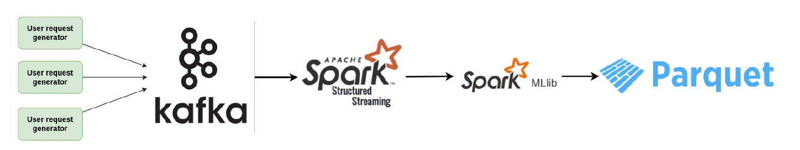

# Distributed streaming recommendation system

The following experimental real-time streaming recommendation system was implemented:

The research question that we are interested in investigating is related to the number of
Kafka and Spark nodes that should be used in the system in order to achieve a sustainable throughput. Secondly, fault tolerance of the system was inspected. 

Specifically, we are going to measure event and processing latency for different configurations of the system, and based on our findings we will conclude on how the relation between Kafka and Spark nodes affects the scalability of the system.

## Executing an experiment on DAS-5
Execute you own experiment on DAS-5 by running the following script:
~~~
$ python3 deployment/das5/run_experiment.py --kafkaNodes <kafka_nodes> --sparkNodes <spark_nodes> --generators <generator_instances> --messages <number_of_messages --time <time_to_generate_messages> --waitTime <time_to_wait_for_experiment_end> --zookeeperInstances 1 --topic <kafka_topic_name> --outputFileName <results_file_name>
~~~

## Executing multiple experiments sequentially
By updating the configuration of the `deployment/das5/experiments_wrapper.py` file, you may create a sequence of experiments that can be executed sequentially with the following command:
~~~
$ python3 deployment/das5/experiments_wrapper.py
~~~